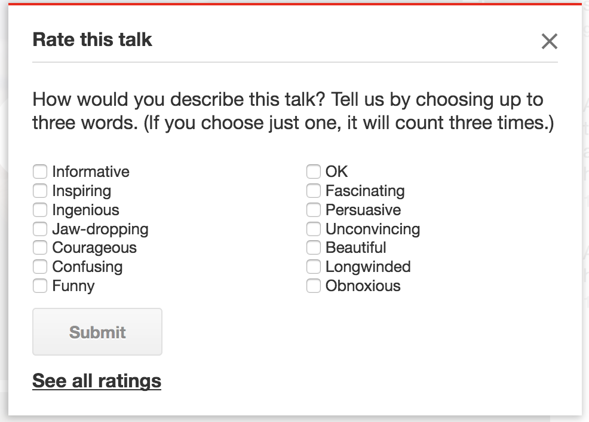

```{r setup, include=FALSE, echo=FALSE, message=FALSE, error=FALSE}
knitr::opts_chunk$set(message = FALSE, warning = FALSE)
Sys.setlocale("LC_ALL", "pt_BR")

library(tidyverse)
```

## Testes A/B, Experimentos (1)

Objetivo:

* Confirmar ou rejeitar uma hipótese que envolva causalidade:
    + Medicamento A cura mais pacientes que a medicação padrão
    + Preço A resulta em maior lucratividade que o preço B

* Não podemos estabelecer a relação causa-efeito sem designar um experimento apropriado
    + Como determinar que o medicamento A curou mais pacientes sem controlar para que outros fatores não influenciem no resultado?
    + Grupo de Controle, Grupo de Tratamento, Randomização

## Testes A/B, Experimentos (2)


## Testes A/B, Experimentos (3)

_Pipeline_:

#. Formulação da hipótese
#. Experimento para testar a hipótese (qual tipo de teste)
    + Estimador: (Média, Desvio Padrão, Distribuição) para testar a hipótese nula
#. Coleta de dados (conjunto limitado) e análise
    + Valor da estatística (Teste Z, teste t) - baseados em tabelas
    + Significância
#. Conclusão

Inferência: 

* Aplicação dos resultados dos experimentos, baseados em um conjunto limitado de dados, em uma população ou em um processo.

## Testes A/B, Experimentos (4)


## Testes de hipóteses: Conceitos

* Hipótese Nula (Ho)
    + A hipótese que buscamos refutar

* Hipótese Alternativa (Ha)
    + A hipótese que esperamos validar

* Nível de Significância
    + Probabilidade de rejeitar a hipótese nula quando ela é verdadeira (Erro tipo I), usualmente 5% ou 1%.

* Diferenças
    + Hipótese Nula: "Não há diferença entre grupos", Alternativa: "A é diferente de B" (pode ser maior ou menor)
    + Hipótese Nula: "Não há diferença entre grupos", Alternativa: "A é maior que B"
    + Hipótese Nula: "Não há diferença entre grupos", Alternativa: "A é menor que B"

## Erros tipo I e II


## Atualmente, em muitos casos

* Dados já estão coletados (observacionais)
* Dados coletados não atendem totalmente os requisitos para experimento
* Hipóteses não podem estabelecer causalidade, pois não há controle sobre os dados já coletados
    + Isso não invalida o uso dos dados para testar hipóteses

## Exemplo: TED Talks

Os vídeos são avaliados em diferentes critérios estabelecidos pela comunidade:

* Critérios positivos, como:
    + Divertido, Inspirador, Belo, De cair o queixo (jaw-dropping)

* Critérios negativos:
    + Muito verboso (Longwinded), Desagradável (Obnoxious), Pouco Convincente


## Exemplo: TED Talks


## TED talks: Grupos e médias

Agrupando os vídeos de acordo com a categoria mais votada de cada vídeo e observando a média de visualizações por vídeos, temos os seguintes destaques:

- De cair o queixo (_Jaw-dropping_): Média de mais de 3.5 milhões de visualizações
- Divertidos: Média de 2.17 milhões de visualizações
- Inspiradores: Média de 1.97 milhões de visualizações

**Reparem que o _rank_ da mediana difere do rank da média**

```{r}
library(MonetDBLite)
library(tidyverse)

if( str_detect(getwd(), "notebooks")) {
  dbdir <- "../data/monetdb/ted"
} else {
  dbdir <- "aula-08/data/monetdb/ted"
}

ted_conn <- MonetDBLite::src_monetdblite(dbdir)
ted_main <- tbl( ted_conn, "ted_main" )

ted_main %>%
  group_by(category) %>%
  summarise( mean   = mean( views )
           , sd     = sd( views )
           , median = median( views )
           , iqr    = quantile( views, 0.75 ) - quantile( views, 0.25 )
           , length = n_distinct( url )) %>%
  ungroup() %>%
  arrange(desc(mean)) -> query_summary_ted_main

query_summary_ted_main
```

## Visualizações em boxplots

Inclusão de _notch_ (entalhe) para comparação das medianas. Os entalhes aproximam um intervalo de confiança de 95% da mediana. Quanto menor o tamanho da amostra, maior será o tamanho do _notch_. "De cair o queixo" é a categoria de menor número de observações entre as 3, e _Inspiring_ possui o maior N.

[Referência sobre _notches_ em Boxplots.](https://www.nature.com/articles/nmeth.2813)

```{r warning=FALSE}
ted_top_categories <-
  ted_main %>%
  filter(category %in% c("Jaw-dropping", "Funny", "Inspiring"))

ted_top_categories %>%
  collect() %>%
  ggplot(aes(x=category, y=views / 1000000)) +
  geom_boxplot(notch = TRUE) +
  scale_y_continuous(limits=c(0, 10), breaks = seq(from=0, to=50, by = 0.5)) +
  theme_minimal() +
  theme(axis.text.x = element_text(angle=45)) +
  labs( x = "Categorias"
      , y = "Visualizações (em milhões)"
      , title = "Boxplot de categorias com maior média de visualizações"
      , subtitle = "Limitado ao máximo de 10 milhões de visualizações.")
```

## Teste U de Mann-Whitney

O [teste de U de Mann-Whitney](https://en.wikipedia.org/wiki/Mann%E2%80%93Whitney_U_test), também conhecido como teste de Wilcoxon-Mann-Whitney, é um teste não paramétrico equivalente ao mais conhecido teste t, e é aplicado nos casos em que não se pode assumir 

- que a distribuição da população segue uma distribuição gaussiana.
- que os tamanhos das amostras são os mesmos. 

Neste teste estamos determinando se duas amostras (público que visualiza diferentes categorias de vídeos) são heterogêneas. 

- Sob a hipótese nula, a distribuição de ambos os grupos é a mesma. 
- Sob a hipótese alternativa, há diferença nas medianas.
    + P(X > Y) <> P(Y > X)

A estatística calulada é uma estimativa da mediana da diferença entre amostras de x e de y.

Testes não paramétricos são mais aplicáveis que seus equivalentes paramétricos por assumirem menos restrições. Por utilizarem _ranks_ (quantis) são também mais robustos a _outliers_. [Comparação com o teste t de Student](https://en.wikipedia.org/wiki/Mann%E2%80%93Whitney_U_test#Comparison_to_Student's_t-test).

O resultado **U** (estatística U) apresentado pelo teste (ou **W** no caso da implementação em R) é um valor que historicamente era consultado em tabela de significância, tal como os testes t e Z, e corresponde à soma dos _ranks_ definidos para os dois conjuntos. [Detalhes na Wikipedia](https://en.wikipedia.org/wiki/Mann%E2%80%93Whitney_U_test#Calculations).

## Teste U de Mann-Whitney - Grupos Funny e Inspiring

```{r}
wilcox.test(views ~ category, data = ted_top_categories, alternative = "two.sided", subset = category %in% c("Inspiring", "Funny"), conf.int = TRUE)
```

## Teste U de Mann-Whitney - Grupos Jaw-dropping e Inspiring
```{r}
wilcox.test(views ~ category, data = ted_top_categories, alternative = "two.sided", subset = category %in% c("Inspiring", "Jaw-dropping"), conf.int = TRUE)
```


## Teste U de Mann-Whitney - Grupos Jaw-dropping e Funny
```{r}
wilcox.test(views ~ category, data = ted_top_categories, alternative = "two.sided", subset = category %in% c("Funny", "Jaw-dropping"), conf.int = TRUE)
```

## Teste de grupos com Kruskal-Wallis

O teste de Kruskal-Wallis testa as hipóteses:

- Ho: os parâmetros de localização da distribuição de visualizações é o mesmo em cada grupo
- Ha: Ao menos um dos grupos difere dos demais

```{r}

ted_top_categories %>%
  collect() %>%
  mutate( category = factor( category )) -> local_ted_top_categories

kruskal.test(views ~ category, data = local_ted_top_categories)
```

## Teste entre pares de grupos com Mann-Whitney

Uma vez detectada a diferença entre ao menos um grupo e os demais, passa a ser necessário testar as combinações de pares. De forma similar o que fizemos anteriormente, mas com uma única função. Percebam que esta função retorna somente os _p-values_.

Método de ajuste do _p-value_:

> Benjamini, Y., and Yekutieli, D. (2001). The control of the false discovery rate in multiple testing under dependency. _Annals of Statistics_ **29**, 1165–1188.

```{r}
pairwise.wilcox.test(local_ted_top_categories$views, local_ted_top_categories$category, p.adjust.method = "BH")
```

## Múltiplos testes e a necessidade de ajustar os _p-values_.


## Múltiplos testes e a necessidade de ajustar os _p-values_.

> Torture os números que eles confessam. 

- Continue testando continuamente e invariavelmente aparecerá um efeito estatisticamente significante.

Temos 13 categorias que devem ser testadas par a par, com um nível de significância usualmente igual a 0.05. O total de testes realizados é de `r sum(1:13)`. A probabilidade de termos um erro de tipo I é muito grande neste caso. Quanto mais pares testados, maior a probabilidade de um padrão emergir como significante sem necessariamente o ser.

Este é um erro similar ao erro de _overfitting_ em _Machine Learning_, necessitando de um procedimento para corrigir este erro.

O mecanismo mais comum de ajuste é o ajuste de Bonferroni, que é um ajuste bastante conservador. Outros mecanismos implementados na linguagem R estão disponíveis no help da função `p.adjust` (`help(p.adjust)` ou `?p.adjust`), sendo Benjamini & Yekutieli (BY) e Benjamini & Hochberg (BH) os métodos mais recentes.

## Testando todas as categorias (boxplot)

Confusing, Longwinded, Ok e Obnoxious ficaram com o _notch_ mais longo que o 1o e o 3o quartil.

```{r}
ted_main %>%
  collect() %>%
  ggplot( aes( x = category, y = views )) +
  geom_boxplot( notch = TRUE ) +
  scale_y_continuous( limits = c( 0, 1*10^7 )) +
  theme_minimal() +
  theme( axis.text.x = element_text( angle = 45 ))
```

## Testando todas as categorias (Mann-Whitney)

```{r}
with( collect( ted_main ) %>% mutate( category = factor( category )), 
     pairwise.wilcox.test(views, category, p.adjust.method = "BH")) ->
  pairwise_matrix

pairwise_matrix
```

## Intuição para um teste de hipóteses

* A hipótese nula afirma que não há diferença entre grupos.
* Desta forma, se combinarmos valores dos grupos A e B, não devemos perceber diferenças.
    + Não há diferença entre os grupos, então por que considerar que os valores são observações de um grupo específico?

```{r}
perm_fun <- function( v_1, v_2 ) {
  x <- c( v_1, v_2 )
  n1 <- length( v_1 )
  n2 <- length( v_2 )
  n <- n1 + n2  
  idx_b <- sample(1:n, n1)  
  idx_a <- setdiff(1:n, idx_b)  
  mean_diff <- mean(x[idx_b]) - mean(x[idx_a])
  return(mean_diff)
}

pull_views_from <- function( tbl, which_category ) {
  tbl %>% filter( category == which_category ) %>% pull( views )
}

plot_diffs <- function( permutation_diffs, mean_1, mean_2 ) {
    ggplot( aes( x = permutation_diffs ), data = data_frame( permutation_diffs )) +
    geom_histogram( bins = 100, fill = "lightgray", color = "black", alpha = 0.6 ) +
    geom_vline( xintercept = mean_1 - mean_2 ) +
    theme_minimal()
}
```

```{r}
perm_diffs <- rep(0, 1000)

all_courageous  <- pull_views_from( ted_main, which_category = "Courageous" )
all_beautiful   <- pull_views_from( ted_main, which_category = "Beautiful"  )
mean_courageous <- mean( all_courageous )
mean_beautiful  <- mean( all_beautiful )

for(i in 1:1000)
  perm_diffs[i] = perm_fun( all_beautiful, all_courageous )

plot_diffs( perm_diffs, mean_courageous, mean_beautiful )
```

```{r}
perm_diffs <- rep(0, 1000)

all_inspiring    <- pull_views_from( ted_main, which_category = "Inspiring" )
all_fascinating  <- pull_views_from( ted_main, which_category = "Fascinating"  )
mean_inspiring   <- mean( all_inspiring )
mean_fascinating <- mean( all_fascinating )

for(i in 1:1000)
  perm_diffs[i] = perm_fun( all_inspiring, all_fascinating )

plot_diffs( perm_diffs, mean_inspiring, mean_fascinating )
```

### Neste caso, como testar?

```{r}

# Falamos sobre Funções de distribuição cumulativa na aula sobre testes.
# A função ecdf cria uma distribuição cumulativa empírica a partir de uma série de valores observados
f <- ecdf(perm_diffs)

# Qual a probabilidade de observarmos uma diferença do tamanho da diferença entre as médias de visualização dos vídeos categorizados como Inspiring e dos vídeos categorizados como Fascinating?
1 - f(mean_inspiring - mean_fascinating)

```

```{r}
plot(f)
```

```{r}
summary(f)
```

# Finalização, desconecta do banco de dados
```{r}
MonetDBLite::monetdblite_shutdown()
```


## ATIVIDADE

#. Selecione um par de categorias **não apresentado anteriormente** nos gráficos
    + Apresentados: Inspiring x Fascinating, Courageous x Beautiful
    + Dê preferência para categorias com mais de 50 observações

#. Aplicar o Teste U de Mann-Whitney

#. Aplicar o teste de permutações com 5000 repetições e exibir o gráfico com histograma e linha vertical da diferença entre as médias.

#. Determinar em qual quantil (percentual inteiro, por exemplo, 81%) se encontra a diferença entre as médias (traçada como linha vertical)
